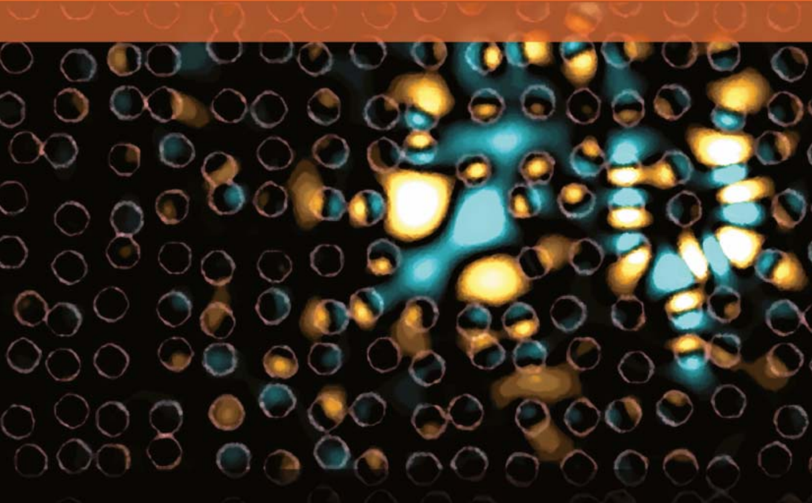
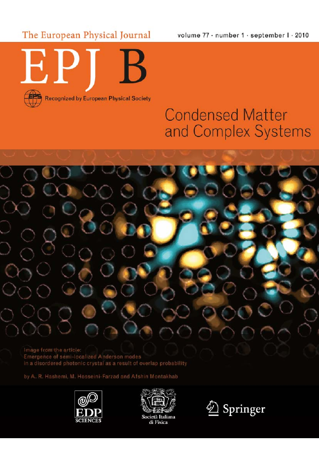

# cpsFDTD

## Complex Photonic Structures Finite-Difference Time-Domain

*cpsFDTD* is a  C++ package for cumputational electrodynamics based on FDTD method. 

|               :memo:  Take note of this                             |
|:--------------------------------------------------------------------|
| Documentation and usable examples will be added as soon as possible |

## Features and Functionalities

- Basic 3D FDTD scheme
- Flexible with different types of material by introducing their optical,
  electrical and magnetic coefficients
- Facilities for designing complicated structures
- Drude-Lorentz model for dispersive and metallic materials
- The Latest version of absorbing boundary condition,
  i.e., convolutional frequency shifted perfectly matched layer (CFS-PML)
- Periodic boundary conditions
- Total-field scattered-field technique with arbitrary orientable incident beam
- Gaussian beam profile
- Three/Four level lasers
- Flexible linear, plane, circular (arc) and spherical output ports
- Parallel computations on CPU
- Visual facilities for illustrating field/intensity distribution on output ports
- Export image and video

## Prerequisites

- OpenMP
- OpenCV
- [CImg](https://github.com/dtschump/CImg)

## Build

(require `makedepend`)

    make depend
    make

## Publications

- A. R. Hashemi and M. Hosseini-Farzad.
*Developing a time-domain method for simulating statistical behavior of many-
emitter systems in the presence of electromagnetic field*.
In: **Phys. Rev. E** 101 (Jan. 2020), p. 013308. DOI: [10.1103/
PhysRevE.101.013308](https://link.aps.org/doi/10.1103/PhysRevE.101.013308).
- A. R. Hashemi, M. Hosseini-Farzad, and Afshin Montakhab.
*Emergence of semi-localized Anderson modes in a disordered
photonic crystal as a result of overlap probability*.
In: **The European Physical Journal B** 77.1 (Sept. 2010), pp. 147–152.
DOI: [10.1140/epjb/e2010-00250-y](https://link.springer.com/article/10.1140/epjb/e2010-00250-y).
- A. R. Hashemi and M. Hosseini-Farzad.
*Fluorescence coherence with anodic aluminum oxide hybrid photonic-plasmonic structure*.
DOI: [10.48550/ARXIV.1811.10465](https://arxiv.org/abs/1811.10465).

 
Simulation of photonic Anderson localization using cpsFDTD,
featured on the cover of EPJB

## License

cpsFDTD is licensed under the GNU Affero General Public License v3.0 .
